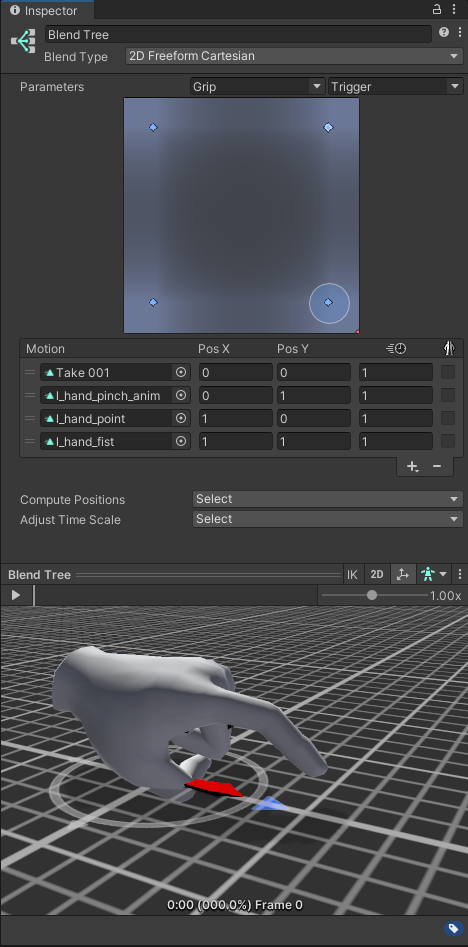
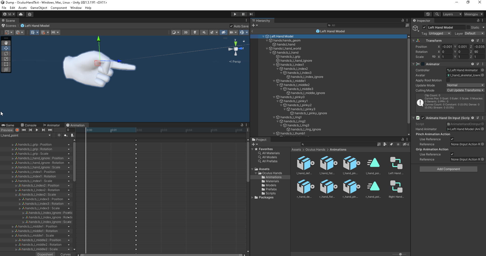

# OculusHand

## preview

## what I added

- add "point animation" for both left and right hand
- add it to blend tree
- when press only "grip" button hand show "point" animation instead of fist
- show fist animation when press both grip and select button

## How To use it

- import the `OculusHandPointAnimation.unitypackage` into your unity project
- use hand in prefab folder
- you still need to setup the script to use your XRI system
- Go at this exact video timestamp https://youtu.be/8PCNNro7Rt0?t=693 and follow the video

old Valem video that talk about this topic

- [Introduction to VR in Unity - PART 2 : INPUT and HAND PRESENCE - YouTube](https://www.youtube.com/watch?v=VdT0zMcggTQ&t=1s)
